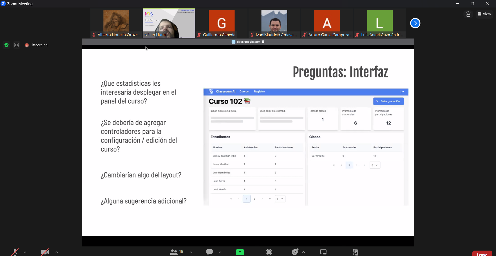
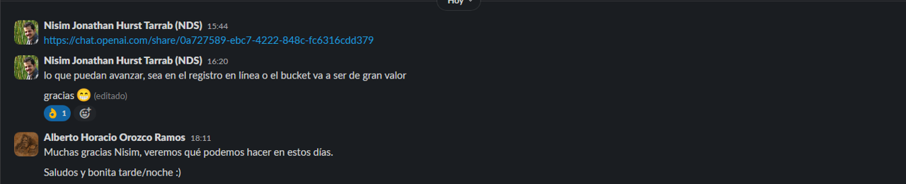

# Momento de Retroalimentación. Metodología del Proyecto

En este directorio puede encontrar los documentos necesarios correspondientes a la metodología establecida a seguir del reto. Cuenta con los siguientes archivos:
* **Documento de Requerimientos.pdf:** Documento PDF que sirve para establecer los requerimientos que el software necesita cumplir en su versión final.
* **Memorándum de Entendimiento.pdf:** Documento PDF que describe el acuerdo bilateral entre el socio formador (NDS) y los alumnos pertenecientes al equipo 2 de la concentración de *Inteligencia Artificial Avanzada II*.
* **Mapeo de Recursos y Herramientas Disponibles.pdf:** Documento PDF que define las herramientas a utilizar para el desarrollo del sistema automatizado de pase de lista y participación.
* **Plan de Proyecto:** Documento PDF que incluye una breve descripción y diagramas que proyectan la metodología a seguir para nuestro proyecto. Así mismo, este documneto incluye una sección asignada para los avances por semana, así como este mismo archivo README a continuación:

    ### **Reporte Semana 1**

    Para esta primera semana se espera que en conjunto como equipo se tenga establecido de forma clara y concisa la problemática a resolver para el socio formador, en este caso NDS Cognitive Labs. Se estableció un sistema de pase de lista y asistencia automatizado basado en Machine Learning y en el uso de Visión Computacional.

    Teniendo en cuenta lo anterior, hemos empezado a trabajar tanto en los algoritmos de visión computacional que se encargará del reconocimiento facial de los estudiantes al momento de entrar al salón y tomar su asistencia y participación. También, se empezó a trabajar en el desarrollo de la plataforma web que administra la captura y registro de los datos recabados, como lo sería el registro de los alumnos, profesores, registro de salones, así como datos de estadísticas sobre la asistencia y la participación. Por otro lado, ya se está pensando en empezar a trabajar en el dataset a utilizar, en nuestro caso pensamos en usar Unity como un recurso para generar estos datasets y aprovechar sus capacidades con el fin de generar diversos ambientes (día, tarde, noche, mucha o poca luz, etc.), esto se hace pensando en que podríamos entrenar el modelo de ML con múltiples casos a nuestro gusto y no solo con videos con características muy parecidas. Es así que este podría aprender de una mayor variedad de posibilidades en vez de probar un conjunto algo más reducido.

    ### **Reporte Semana 2**

    Esta segunda semana hemos avanzado significativamente tanto en el desarrollo de la interfaz web como en los modelos que se utilizarán para emular un salón de clases con Unity 3D. En cuanto a la interfaz ya se tenía la base con la cual se trabajará de ahora en adelante, además de incluir un backend basado completamente en Fast API, el cual permite una conexión directa con los scripts de OpenCV, lo que facilitará su implementación posteriormente. Por el lado de la simulación, se trabajaron elementos como un escenario principal base y al menos 3 diferentes modelos de personajes con animaciones básicas, y adicionalmente, se probó el algoritmo de reconocimiento facial con estos mismos personajes y funciona de forma óptima.

    También se trabajó en el entregable relacionado a la metodología del proyecto, que incluye elaborar un documento de requerimientos sencillo, un memorándum de entendimiento entre nuestro equipo y el socio formador, un mapeo de los recursos y herramientas a utilizar para el desarrollo del proyecto y un plan general de la metodología a implementar.

    ### **Reporte Semana 3**
    Para la tercera semana se dejó pendiente el apartado de la simulación en Unity 3D para dar paso al desarrollo de la interfaz web. Básicamente, se añadieron algunos scripts necesarios para la generación de un dataset de imágenes que pudiera ser utilizado como complemento a los modelos pre-entrenados que ya teníamos previamente programados. Habiendo implementado esto, solo hacía falta agregarlo como una funcionalidad dentro de la interfaz web, por lo que se aprovechó Fast API para conectar directamente los scripts de Python con el frontend de la aplicación. El resultado final fue lograr la carga de un video del rostro de una persona para analizar desde el frontend, para posteriormente procesar dicho video, convertirlo en el dataset de imágenes, y en base a otro video dónde aparezca la misma persona, hacer el reconocimiento facial desde el mismo frontend.

    Se espera que para la semana 4 estemos implementando el reconocimiento de participación de una persona en conjunto con los avances de esta semana.

    ### **Reporte Semana 4**
    Para esta semana 4 se llevo a cabo la continuación del desarrollo tanto de la aplicación web como de la simulación en Unity 3D. Por el apartado de la interfaz, se aplicaron los siguientes avances:

    * Implementación de AWS S3
    * Verificación de correo de usuario
    * Reconocimiento facial de usuario
    * Creación de cursos
    * Implementación de reconocimiento facial de usuario a través de API y S3

    En cuanto a Unity 3D, se logró obtener un escenario de un salón de clases con sillas, escritorios, ventanas, iluminación, lo más importante, se obtuvieron los diseños de los agentes o personajes que se utilizaran para actuar como alumnos dentro de la simulación.

    Para la semana 5 se espera seguir avanzando por el apartado web, a su vez que se comienza a trabajar con las animaciones y movimientos de los agentes (personajes) de Unity.

    ### **Reporte Semana 5**
    A lo largo de esta semana y como era esperado, se trabajó en la interfaz web, la cual ahora permite crear cursos que incluyen el nombre, la ubicación (edificio y número) y permite agregar los estudiantes que forman parte de la misma. Al crear un curso, es posible visualizar información más detallada (además de la antes mencionada), esto incluyendo el total de sesiones realizadas y el promedio tanto de asistencias como de participaciones durante las clases, así como sus respectivas asistencia y participación por alumno, haciendo posible filtrar esta información por fechas.

    En cuánto a Unity, se cambió el color de fondo del salón para que resultase más sencillo identificar tanto rostros como poses dentro de la emulación, y además, se arreglo la iluminación de la escena con el fin de tener una mejor visualización de lso elementos que aparecen en la misma. En cuanto a los modelos de Unity, se obtuvo finalmente el movimiento completo de los personajes de forma automática con la ayuda del componente llamado NavMeshGrid de Unity para generar agentes con IA que se mueven en base a objetivos (en nuestro caso los asientos) y a la definición del entorno en el que puede trasladarse (el salón de clase).

    Esperamos que para la siguiente semana se continúe con el desarrollo de los modelos de inteligencia artificial con algoritmos de redes convolucionales. Principalmente buscaremos reemplazar el modelo de haarcascade de reconocimiento facial, debido a que no lo consideramos lo suficientemente preciso como para implementarlo en conjunto con el modelo de pose, inclusive para la participación. Más que nada se tomó esta decisión ya que resulta ser muy inestable y requiere un volumen de datos bastante robusto, cosa que no sucede con otras librerias y modelos pre-entrenados.

    ### **Reporte Semana 6**
    Esta semana se dedicó completamente para el desarrollo de los algoritmos tanto de reconocimiento facial como el de pose. Primeramente se probaron con varias librerías nuevas con el fin de encontrar la mejor entre todas e intentar implementarla a las necesidades de nuestro proyecto.

    Para el reconocimiento facial y registro de asistencia se considero la librería **facial_recognition**, que es muy fácil de usar y adaptar. Seguimos algunos tutoriales y foros para adaptar el código y logramos que el algoritmo reconociera personas con una sola foto sin requerir un mayor volumen de datos como la haarcascade que utilizamos previamente. Habiendo cumplido con esto, ya solo hacía falta registrar una asistencia a la persona que corresponda, logramos cumplir con el registro de asistencias en un video, ya sea en vivo o grabado.

    Por el lado del modelo de participación, decidimos utilizar la librería **mediapipe** para estimar la pose de los individuos que aparecen en un video. Se probó con la implementación de un algoritmo simple que detecta cuando una persona levanta su brazo y lleva un contador de cuántas veces ha realizado esta acción. Después, se probó implementando 2 modelos de poses trabajando al mismo tiempo, lo cual funciona pero solo en casos muy específicos y tiende a presentar fallos con mucha facilidad. Finalmente, se intentó integrar ambos algoritmos, reconocimiento facial y de pose, para observar cómo se comportaban en conjunto. El modelo de asistencia actuaba con normalidad, mientras que la participación junto al reconocimiento facial tiende a presentar fallas y otorga la participación a las personas que no corresponden o bien a veces no otorga participación.

    Es por lo mencionado anteriormente, que para la semana 7 se refinen y corrijan estos detalles. Inclusive, se pensó en implementar YOLO como una herramienta de reconocimiento de objetos, para que con ello primero se reconozcan personas, luego a cada una se genere un modelo de pose y finalmente, cuando un alumno levante la mano, se busque su cara y se haga reconocimiento facial para registrar su participación en el sistema.

    ### **Reporte Semana 7**
    Durante esta semana nos concentramos en perfeccionar los resultados del modelo de participación. Tuvimos que buscar arduamente en muchos foros de discusión, tutoriales, documentación y artículos relacionados a **Mediapipe** y a **YOLO**. Lo que encontramos es que en efecto es posible utilizar ambos modelos, e inclusive encontramos un código de ejemplo que asigna hasta 6 distintos modelos de pose para cada persona utilizando **yolov5** y **mediapipe**. Teniendo este procedimiento como referencia, logramos replicarlo e implementarlo dentro de nuestro código. El modelo de participación demostró tener resultados decentes, sin embargo, creemos firmemente que esto puede mejorar, más si tomamos en cuenta que el modelo presenta algunas fallas al momento de asignar participaciones, como por ejemplo, asigna participaciones de más si el estudiante mantiene su brazo levantado, cuando debería de detenerse y considerar solo una participación cada que se levante la mano, no durante el tiempo que se conserve levantada. Otro detalle a mejorar es que suele confundir personas al momento de asignarles su respectiva participación, y esto resulta ser muy extraño, debido a que el modelo de reconocimiento facial funciona a la perfección por si solo, así que sospechamos que esto se debe a la forma en la cual enviamos los datos al modelo de reconocimiento facial.

    Por otro lado, también se trabajó en el deployment de la aplicación web a AWS por medio de una instancia de EC2. Para ello, revisamos documentación tanto de AWS EC2 como de Fast API para montar el backend en la nube de Amazon.

    ### **Reporte Semana 8**
    Esta semana se trabajó en afinar detalles que el modelo de pose presentaba. Algunos comportamientos no deseos por este eran que al levantar el brazo, el tiempo que se mantenía arriba se contaban indefinida cantidad de participaciones a la persona levantando la mano. Otro detalle es que el modelo otorgaba participaciones a personas que no debía de otorgarles participación y otros detalles menores que se corrigieron.

    Por el lado de la aplicación web, se busca empezar a implementar la aplicación en la nube con ayuda de EC2 de AWS, tal y como se realizó con el backend.

    Para la siguiente semana se espera tener el modelo de pose funcionando lo mejor posible, además de que la aplicación web (o al menos los endpoints correspondientes) debe estar lista para implementar los modelos tanto de asistencia como participación.

    ### **Reporte Semana 9**
    Esta semana se empezó a trabajar los endpoints que manejan las funciones de los modelos de participación y asistencia dentro del backend de la aplicación de forma local.

    En cuanto al apartado web se empezó a implementar el usuario administrador además de los roles de estudiante y profesor que ya existían. También se terminó de subir la aplicación en la nube sin los modelos de predicción con fines de probar el redimiento de la misma solo con el frontend y backend. Es por ellos que durante este semana y a más tardar inicios de la siguiente se espera hacer el deploy final de la aplicación con todos los modelos y sus funcionalidades completas.

    ### **Reporte Semana 10**
    A inicios de esta semana trabajamos los últimos detalles de la aplicación, conseguimos hacer deploy de la página a la nube en una instancia de AWS utilizando una instancia de EC2 para alojar la aplicación (frontend y backend), incluyendo los modelos de participación y asistencia.

    Preparamos toda la documentación necesaria para las entregas finales, incluyendo la presentación y el reporte final para mostrar los resultados finales al socio formador.

## Canal de Comunicación con el Socio Formador (NDS)
Como medio para contactar al socio formador que nos acompaña durante el planteamiento y desarollo de este proyecto tenemos un canal abierto de comunicación tanto por la aplicación de *Slack*, como una sesión semanal por zoom. Dentro de este apartado se adjuntarán las evidencias tanto de reuniones como chats con los miembros de NDS:

* Chat entre el socio formador y el equipo para proveer acceso del repositorio del reto al socio formador (21/Sep/23):

    

* Chat entre el socio formador y el equipo para otorgar acceso a los repositorios tanto de frontend como de backend (2/Oct/23):

    

* Evidencia de reunión con el socio formador (23/Oct/23):

    

* Chat entre el socio formador y Alberto para reenviar invitación a repositorios de Frontend y de Backend (23/Oct/23):

    

* Evidencia de reunión con el socio formador (06/Nov/23):

    

* Evidencia de reunión con el socio formador (13/Nov/23):

    

* Evidencia de reunión con el socio formador para acceso a la plataforma (17/Nov/23):

    
    

* Evidencia de reunión con el socio formador para revisar avances finales (22/Nov/23):

    
    

## Cambios realizados con respecto a la entrega anterior
Se realizaron varias observaciones por parte del docente con respecto a la primera versión de los entregables, por lo cual, se realizaron ciertas modicaciones con el fin de cumplir con los criterios de la rúbrica que no se lograron alcanzar previamente. Es por ello que, a continuación se presentan las modificaciones realizadas al trabajo basados en la retroalimentación proporcionada por criterio faltante:

* **El levantamiento de requerimientos es completo y correcto.**
   * Esta marca ya se había cumplido, sin embargo el docente recomendó especificar más los requisitos, en especial los relacionados a los modelos de pose y reconocimiento facial, además de organizarlos en nivel de prioridad

* **El repositorio incluye un mapeo de recursos y herramientas disponibles.**
   * Esta marca ya se había cumplido, sin embargo el docente recomendó especificar exactamente con qué recursos se cuenta.

* **Las referencias utilizadas están citadas de forma correcta.**
   * Esta marca ya se había cumplido, sin embargo el docente recomendó El diagrama dice que incluye los reponsables, pero los mismos no están incluidos en el diagrama

* **La sección de avance de trabajo por semana contiene información para todas las semanas (solo aplica para entrega final)**
    * Esta marca ya se había cumplido, sin embargo el docente recomendó completar el reporte de la semana 4, así como darle seguimiento a lso avances y registrarlos con cada semana de avance. Esto se cumplió actualizando los reportes semanales que faltaron en su momento, y también colocando nuevos registros. También se incluyó una sección de canal de comunicación con el socio formador que proyecta todas las interacciones por parte de nuestro equipo con el socio.
